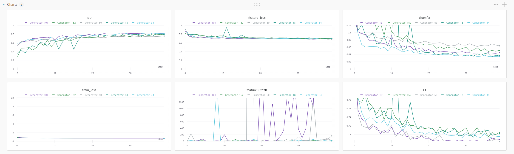

# Git Workshop Exercise
In this exercise your team will create a mini-website (with simple markdown pages) documenting your project.
There are several tasks to complete (listed as `GitLab Issues`), but take these with a pinch of salt.
The questions should get you thinking about positive open-source documentation, but the priority here is to **practice conflict resolution with Git**.

To complete the exercises you'll just need to edit markdown files (end with a `.md`) with any text-editor.
The `#`'s are for headings (more `#` means smaller).
Wrap text in `*` for italics or `**` for bold and `\`` for code-blocks (`\`\`\`` for multi-line code blocks).

Think very carefully about your actions (creating files, editing files, where you create a branch from...) and discuss any doubts/questions with your teammates.
If you stay conscious of what you're doing, you'll quickly become a Git lean mean machine!
Please **work on merging and fixing conflicts together** where possible.
Note that it may be useful to use a visual UI to show what changes have been made (VScode is a great choice).

# Setup and Workflow
Sart by forking and cloning this repository (`git clone YOUR_REPO_LINK`).
There will be a fork button near the top right hand side of the screen (left of the blue clone button).
**Only one person per-team should do this** (you can share screen with everyone else so they know how too though)!
Once you've got your own GitLab repository clone it (hitting the clone button and then HTTPS will give you the URL) to use in `git clone REPO_LINK`.

Once everyone knows what task they'll start with create a feature branch to work in (`git checkout -b some-feature-branch`, but use a meaningful name which doesn't include the words feature branch).
Although it won't be immidiately useful, do recall that you by default branch from your current (**not `master`**) branch.

> Remember, each task should be completed in a new branch!

You should gradually commit (`git commit -m "ADDED COOL THING/CHANGED BLAH BLAH BLAH"`) your changes.
Once you've completed a task make sure to push (`git push`) everything and create a pull request (through the website).

Before creating a pull request remember to get the latest changes (`git pull`).
This is one place where conflicts may occur (hint - this is when rebases are useful).

# Project Decription 
Reconstructing facial features from skeletal remains using CT scans.

The aim of this project is to create, implement and train a set of neural network models that accurately generates reconstructed generalised 3D volume images from 3D CT skeletal head scans.
Identifying skeletal remains is a challenging problem which typically can involve sketching or rebuilding the original face using modelling clay. 
This project attempts to use CT scans to generate the face more accurately without the need for these methods. 
The project takes a skull as input and uses a Generative Advesarial Network (GAN) to reconstruct facial tissue on top of the skull which is then compared to the original flesh. 
The project will not only investigate a 3D approach, but also trial using 2.5D Depth Map representations of the front of the 3D skull and flesh as input and label, respectively. 

# Contributors
 Current team members:
 - David Ting (Team Lead)
 - Mitchell Hargreaves
 - Stephen Bajan
 - Kamron Bhavnagri
 - Rafique Anwar
 - Peter Kaltzis

 Project alumni:
 - Aryan Faghihi
 - Johnny Liaw
 - Matthew Timms
 - Kareeb Hasan

 # How to contribute:
 To run the code first fork or clone the git repo using
 `git clone https://github.com/KamWithK/GitWorkshop.git`
and create a conda environment to handle the project dependencies.
`conda env create -f environment.yml`
Install dependencies with
`conda env update -f environment.yml --prune`

*To update dependencies simply run `conda update --all` for packages and `conda update -n base -c defaults conda` for conda itself!*

# Recommended min specs:
- Linux (known issues with Windows installation)
- GPU: Requires CUDA version > 3.5
- CPU: Intel i7-4800
- RAM: >8GB DDR3

## Requirements 

The following python modules/libraries are required:

- **scipy** - for 2D/3D image processing utilities. 
- **pydicom** - for processing CT images in DICOM format
- **matplotlib** - for plotting/Graphing
- **pytorch** - for training deep neural network models
- **torchvision** - for preprocessing image dataset.
- **mayavi** - for rendering 3D visualisation.

